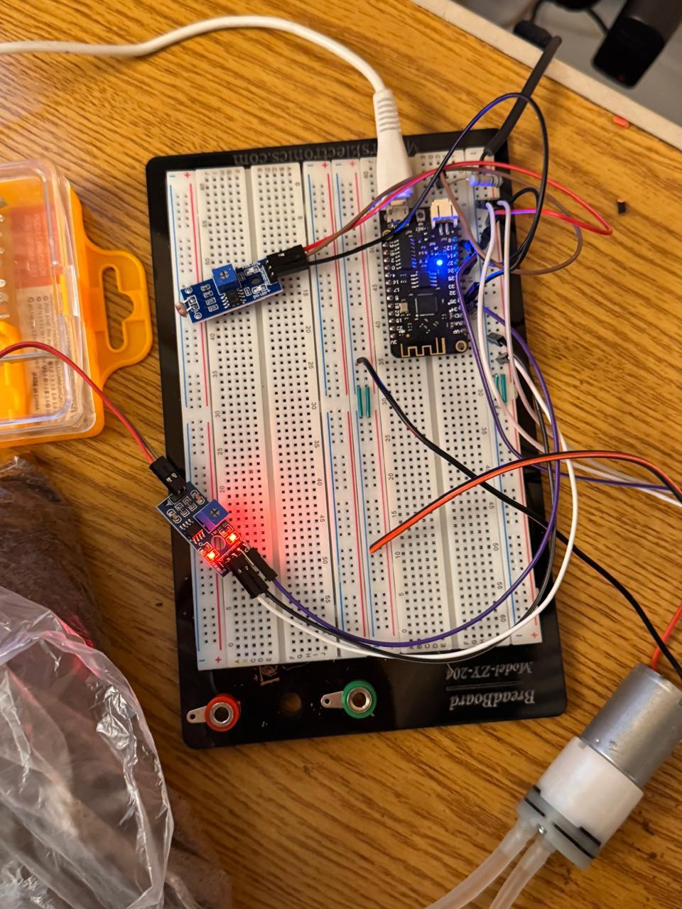
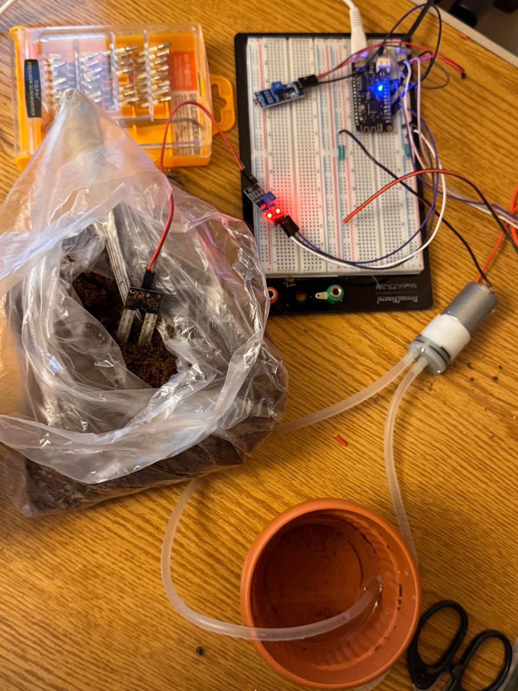

# smart-irrigation-system
IoT-based smart irrigation system using ESP8266, sensors, and Python backend
# Smart Irrigation System 🌱💧

A smart irrigation system designed to monitor environmental conditions and automate water delivery using sensor-based control logic and a Python backend. Developed as part of a university project for the Advanced Networks course in Computer Engineering.

---

##  Features

- Real-time **soil moisture** and **light** monitoring using analog sensors
- **Light sensor condition**: irrigation only operates during daylight
- Automatic pump activation based on sensor thresholds
- **Manual control via mobile/web interface** to activate the pump anytime
- Python backend handles sensor data, control logic, and mobile/web requests
- WiFi communication using HTTP requests between ESP microcontroller and backend
- Basic water usage tracking

---

##  Tech Stack

- **Microcontroller**: ESP8266 (NodeMCU)
- **Backend**: Python (Flask or similar web framework)
- **Frontend**: HTML, JavaScript (mobile/web interface)
- **Sensors**:
  - Soil moisture sensor
  - Light sensor (LDR)
  - Water flow sensor
- **Communication**: WiFi using HTTP requests from ESP to Python server

---

##  How It Works

1. Sensors collect **soil moisture** and **light level** data.
2. The ESP8266 sends this data to the **Python backend** via HTTP requests.
3. The backend:
   - Evaluates conditions for **automatic pump activation** (if it's dry and daylight)
   - Listens for **manual activation requests** from the mobile/web interface
4. The system controls the pump through GPIO outputs (or responds to the ESP with ON/OFF instructions).
5. Sensor data and pump logs are optionally stored or displayed in the interface.

---

##screenshots of the circuit
  ### Hardware Setup  

### Web Interface  

---

##  What I Learned

- Building an end-to-end smart system from hardware to frontend UI
- Writing and deploying a backend in **Python** to control real-world hardware
- Communicating between IoT devices and web servers via HTTP
- Managing sensor input, logic conditions, and real-time actuation
- Collaborating in a team under project deadlines with real-world integration

---

##  Contributions

Project developed by [mariam saad , and my group]  
Part of the Advanced Networks course at [AAST], [Semester 6/2025]

---

##  Disclaimer

This project was developed for educational purposes. Some components may be simplified or partially implemented. Code shown is for demonstration and academic use only.
